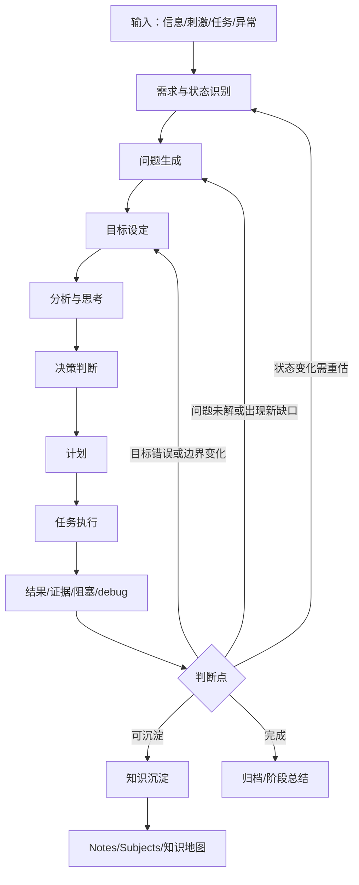

# Obsidian思维笔记系统-设计-20260524-001

## 1. 设计定位

本设计用于回答一个问题：如何把 Obsidian 中的笔记系统改造成更适合“思维运作”的系统，而不是只做资料存储、日记归档或普通卡片盒。

本设计参考三类来源：

1. ES_notebook 既有思维机制笔记，尤其是 [[思维机制-笔记-20260527-001]]、[[思维机制之解决问题-问题-20260527-001]]、[[内进内出型思维过程-笔记-20260527-001]]、[[内生问题、外生问题_20210729]]、[[关于判断点：“我知道了”]]、[[前提与目标互相约束]]、[[任务运行过程可以被中断_20220724]]、[[任务-任务-20260527-001]]、[[任务之目标-目标-20260527-001]]。
2. SystemicRiskResearch 的 `Operate/` 大量实例，尤其是“问题、分析、思考、plan、debug、memo、design、交流”等过程型笔记的真实分布。
3. autodo-suite、autodo-engine、autodo-kit 的任务调度、状态机、决策闭环、taskdb、知识工具和 Obsidian 桥接能力。

本设计的核心结论是：

> Obsidian 应作为思维外化界面与长期可读记忆；autodo-suite 体系应作为任务生命周期、流程状态、审计和知识整理的外部控制面。二者不应互相替代，而应形成“可读笔记 + 可运行任务状态”的双层系统。

## 2. 继承的 ES 思维机制

ES_notebook 中已有的思维机制不应被新的笔记系统覆盖，而应成为新系统的底层语义。

### 2.1 需求、状态、问题、目标

[[思维机制-笔记-20260527-001]] 中已经明确：当【现状】与【需求】导致预期不一致时，会生成【问题】。[[思维机制之解决问题-问题-20260527-001]] 中的流程是：

1. 描述需求。
2. 描述现状。
3. 根据需求和现状发现问题。
4. 根据问题设定目标。
5. 分析实现目标的过程。
6. 汇总出解决问题的流程。

并且第五步“分析实现目标的过程”还需要按实际情况循环前面的步骤。因此，新 Ob 思维笔记系统不能把流程设计成单向的“目标 -> 问题 -> 分析 -> 计划 -> 任务 -> 完成”，而应设计成可回溯的大循环。

### 2.2 大回环应回到问题，也可以追溯到目标

回环首先应回到【问题】：

- 执行结果是否解决了原问题？
- 原问题是否被证明是伪问题？
- 是否产生了更细的问题？
- 是否需要把外生问题转化为内生问题？

但回环也应允许追溯到【目标】：

- 原目标是否设置错了？
- 目标是否过大、过小或不符合前提约束？
- 目标是否需要拆分为多个阶段目标？
- 当前任务是否仍服务于原目标？

这对应 [[前提与目标互相约束]] 中的观点：工具使用的约束和待实现对象的约束会共同限制目标。因此，目标不是固定不变的起点，而是可以被执行结果反向修正的对象。

### 2.3 判断点、中断点和恢复点

[[关于判断点：“我知道了”]] 指出，进入下一个问题或任务之前需要一个判别器。[[任务运行过程可以被中断_20220724]] 指出，任务运行可以被中断，并且需要记录中断点。

因此，每一轮思维过程都应显式记录三类点：

1. 判断点：我是否可以进入下一个问题、任务或阶段。
2. 中断点：为什么暂停，停在哪里，恢复需要什么条件。
3. 恢复点：下次继续时应装载哪些目标、问题、状态、证据和任务。

## 3. 从 SystemicRiskResearch Operate 得到的经验

SystemicRiskResearch 的 `Operate/` 不是传统意义上的知识卡片库，而是一个高密度的思维过程库。它的真实使用方式说明：复杂研究与工程任务不是线性推进，而是在以下笔记类型之间反复循环：

- `问题`：记录认知缺口、异常、争议或待判断项。
- `分析`：比较路径、解释机制、建立方案、形成临时判断。
- `思考`：更自由的概念展开、模型直觉和方向探索。
- `plan`：阶段路线、边界、任务顺序和验收标准。
- `debug`：运行结果、错误、适配规律和最低验收口径。
- `memo`：阶段性总结、恢复上下文和后续建议。
- `design`：相对稳定的结构方案。
- `交流`：外部反馈、人机对话、导师建议和批判意见。

这说明，新系统不应强迫所有笔记进入同一种“永久卡”格式。更合理的做法是承认过程型笔记的价值，让它们围绕问题和目标形成可追溯网络。

## 4. 总体系统分层

建议把 Ob 思维笔记系统分为五层。

### 4.1 输入层

输入层承接外部刺激和内部念头：

- 外部问题、导师建议、AI 回答、文献摘录、代码报错、实验结果。
- 内部想法、怀疑、直觉、情绪性需求、突然意识到的矛盾。

对应目录可包括 `Collection`、`Clippings`、`Ideas`、`DailyNotes`。

### 4.2 Operate 层

Operate 层承接思维正在如何推进：

- `目标`
- `现状`
- `问题`
- `原因`
- `分析`
- `思考`
- `想法`
- `计划`
- `任务`
- `交流`
- `debug`
- `memo`
- `design`

Operate 层不追求一开始就干净。它的首要目标是保留思维运动轨迹，使后续可以回放、恢复、反思和沉淀。

### 4.3 任务生命周期层

任务生命周期层管理任务状态、阻塞、验证和完成标准。它更适合由 autodo-engine 或 autodo-suite 体系管理，而不是单靠 Obsidian 手写清单。

建议任务状态为：

1. `inbox`：刚捕获，尚未澄清。
2. `clarifying`：正在澄清目标、问题和边界。
3. `planned`：已有计划但尚未执行。
4. `active`：正在执行。
5. `blocked`：被前置条件、资源、知识或权限阻塞。
6. `verifying`：正在检查结果是否满足目标和问题。
7. `done`：已完成，等待沉淀或归档。
8. `archived`：已归档，仅保留追溯价值。

### 4.4 知识沉淀层

知识沉淀层只承接经过过程验证的内容：

- 概念卡。
- 机制卡。
- 方法卡。
- 模型卡。
- 证据卡。
- 经验卡。
- 失败教训卡。

它对应 `Notes`、`Subjects`、`Theory`、`Reference` 等目录。这里不应直接塞入大量 AI 问答原文或 debug 原文，而应从 Operate 层提炼。

### 4.5 视图层

视图层负责组织不同观察角度：

- 当前活跃目标。
- 当前活跃问题。
- 当前阻塞任务。
- 待验证结论。
- 待沉淀知识。
- 已完成但未归档任务。
- 某项目的外部管理台账。
- 某主题的知识地图。

视图层可以由 Obsidian 索引页、Bases、Canvas、Dataview 或 autodo 导出的审计视图共同承担。

## 5. 大循环流程图



这个图的重点不是流程节点本身，而是三种回环：

1. 回到【问题】：这是最常见的大循环。
2. 回到【目标】：当发现原目标错误、模糊或不再适用时触发。
3. 回到【需求与状态】：当环境、资源、知识、约束发生变化时触发。

## 6. 笔记类型设计

### 6.1 目标笔记

目标笔记用于说明“我希望达成什么”。它不等于任务清单。

建议字段：

- 目标描述。
- 完成标准。
- 约束条件。
- 服务的上层目标。
- 当前关联问题。
- 目标修订记录。

### 6.2 问题笔记

问题笔记是系统核心。

建议字段：

- 问题表述。
- 来源：外生问题或内生问题。
- 由哪些需求与状态生成。
- 当前重要度。
- 关联目标。
- 已有分析。
- 当前判断点。
- 下一轮问题。

### 6.3 分析笔记

分析笔记用于比较方案、解释机制、处理证据。

建议字段：

- 触发问题。
- 当前判断。
- 证据与材料。
- 方案比较。
- 风险与反例。
- 决策。
- 回到哪个问题或目标。
- 可沉淀知识候选。

### 6.4 计划笔记

计划笔记用于把目标和问题转成阶段路线。

建议字段：

- 承接目标。
- 承接问题。
- 阶段划分。
- 每阶段任务。
- 阶段门槛。
- 当前明确不做的事项。
- 验收口径。

### 6.5 debug 和 memo 笔记

debug 记录执行与验证，memo 记录阶段恢复点。

debug 应回答：

- 跑了什么。
- 得到什么。
- 哪些已验证。
- 哪些只是入口层、配置层或模型层部分打通。
- 下一步回到哪个问题或目标。

memo 应回答：

- 当前上下文是什么。
- 当前最重要判断是什么。
- 下次从哪里恢复。
- 哪些内容应该沉淀成知识。

## 7. 文件命名规则

不建议全局采用同一种文件命名规则。应区分过程型文档与快照型文档。

### 7.1 过程型文档：日期前置

适用于 record、summary、archive、memo、debug、交流记录、运行日志。

推荐格式：

```text
20260524-IB1112模型迁移-debug-001.md
20260524-A100待研读清单筛选-memo-001.md
20260524-第三稿整改推进-record-001.md
```

理由：过程型文档最常见的检索方式是按时间回放和追溯。

### 7.2 快照型与知识型文档：类型前置

适用于 design、manual、guide、spec、knowledge、template。

推荐格式：

```text
design-Obsidian思维笔记系统-20260524-001.md
guide-Operate笔记写法-20260524-001.md
spec-任务生命周期字段表-20260524-001.md
knowledge-空间面板方法适用边界-20260524-001.md
```

理由：快照型文档首先需要识别文档性质，其次才是时间。

### 7.3 思维过程笔记：保留中文类型前缀

Operate 中的中文思维笔记可以保留现有风格：

```text
问题：空间面板权重矩阵如何设定-20260524-001.md
分析：实证方法选择决策-20260524-001.md
思考：银行传染事件在一个MDP回合内传递一轮还是多轮-20260524-001.md
计划：第三稿总整改方案-20260524-001.md
debug：适配与运行规律-20260524-001.md
```

理由：这类文件需要在 Obsidian 中快速识别思维动作类型。中文前缀比纯英文文档类型更符合实际阅读。

## 8. frontmatter 建议

```yaml
---
title: 分析：实证方法选择决策-20260524153000
date: 2026-05-24
tags:
  - 类型/运作
  - 运作/分析
  - 项目/SystemicRiskResearch
  - 内容/实证方法
status: active
task_uid: task_xxx
question_uid: q_xxx
goal_uid: goal_xxx
source:
  - "[[问题：用面板还是时间序列方法分析银行业系统性风险]]"
next:
  - "[[问题：空间面板权重矩阵如何设定]]"
  - "[[计划：实证识别策略整理]]"
return_to:
  - question
  - goal
knowledge_candidates:
  - 空间面板方法适用边界
  - 仿真模型输出转实证变量的方法
---
```

其中：

- `task_uid` 由 autodo 体系管理。
- `question_uid` 用于把多篇分析、计划、debug 和 memo 绑定到同一个问题。
- `goal_uid` 用于支持回环追溯到目标。
- `return_to` 明确本轮结果应回到问题、目标、状态或归档。

## 9. autodo-suite 的引入边界

建议引入 autodo-suite，但不要让它替代 Obsidian。

### 9.1 Obsidian 负责什么

Obsidian 负责：

1. 人可读的思维过程记录。
2. 双链、嵌入、索引页、Canvas、Bases 视图。
3. 过程笔记、知识笔记和项目外部台账。
4. 人工判断点、解释性文字和概念沉淀。

### 9.2 autodo-engine 负责什么

autodo-engine 负责：

1. 任务生命周期状态机。
2. 任务步闭环。
3. 候选动作、决策记录和执行回执。
4. taskdb 与审计视图。
5. 阻塞、恢复、完成、失败、取消等状态转换。

### 9.3 autodo-kit 负责什么

autodo-kit 负责：

1. Obsidian 依赖解析与导出。
2. 任务文档生成。
3. 知识条目整理。
4. 工具调用与事务封装。
5. 从过程材料中抽取知识候选。

### 9.4 分阶段接入

第一阶段：旁路索引。

- 不改动既有笔记结构。
- 只为新 Operate 笔记增加 `task_uid`、`question_uid`、`goal_uid`。
- 由 autodo 生成任务状态视图。

第二阶段：双向同步。

- Obsidian 新建问题或任务时，可登记到 taskdb。
- taskdb 状态变化时，生成或更新 Obsidian 状态视图。
- 每个任务可反链到目标、问题、计划、debug、memo。

第三阶段：知识沉淀辅助。

- autodo-kit 扫描完成任务和 memo。
- 输出待沉淀知识候选。
- 人工确认后进入 Notes 或 Subjects。

第四阶段：流程模板化。

- 将高频研究流程、工程调试流程、文献研读流程设计成可运行 workflow。
- workflow 不替代思考，而是帮助记录状态、提醒回环、生成恢复点。

## 10. 视图设计

建议至少建立以下视图：

1. 活跃目标视图。
2. 活跃问题视图。
3. 问题到任务映射视图。
4. 阻塞任务视图。
5. 最近 debug 结果视图。
6. 待沉淀知识视图。
7. 已完成但未归档视图。
8. 目标修订历史视图。

这些视图可以先用 Obsidian 索引页手工维护，后续再逐步迁移到 Bases 或 autodo 导出视图。

## 11. 最小可行落地方案

第一步：建立三类核心模板。

- `目标` 模板。
- `问题` 模板。
- `分析` 模板。

第二步：所有新的 Operate 笔记都至少填写：

- 承接目标。
- 承接问题。
- 当前判断。
- 下一步回到哪里。
- 可沉淀知识候选。

第三步：建立一个“活跃问题索引”。

- 每个问题列出关联目标、分析、计划、任务、debug 和 memo。
- 每轮执行后都回到该索引更新问题状态。

第四步：建立一个“目标修订记录”。

- 当执行结果反向改变目标时，记录为什么改、改成什么、影响哪些问题和任务。

第五步：再接入 autodo-suite。

- 先只让 autodo 管理任务状态。
- 不让 autodo 自动改写旧笔记。
- 只生成外部视图和候选沉淀清单。

## 12. 结论

新的 Ob 思维笔记系统应被理解为一个“目标-问题驱动的思维运作系统”。它不是单纯的知识库，也不是普通任务管理器。

其核心结构是：

1. 由需求与状态生成问题。
2. 由问题设定或修订目标。
3. 由目标和问题驱动分析、计划和任务。
4. 由执行、debug 和交流产生证据。
5. 由判断点决定回到问题、目标、状态，或进入知识沉淀与归档。

在这个系统中：

- `问题` 是最常见的循环中心。
- `目标` 是可被回溯修订的上层约束。
- `任务` 是执行单元，不是思维中心。
- `知识` 是经过过程验证后的沉淀物。
- `autodo-suite` 是外部控制面，不是 Obsidian 的替代品。

最终目标不是让笔记更整齐，而是让思维过程可以被中断、恢复、审计、复用和沉淀。