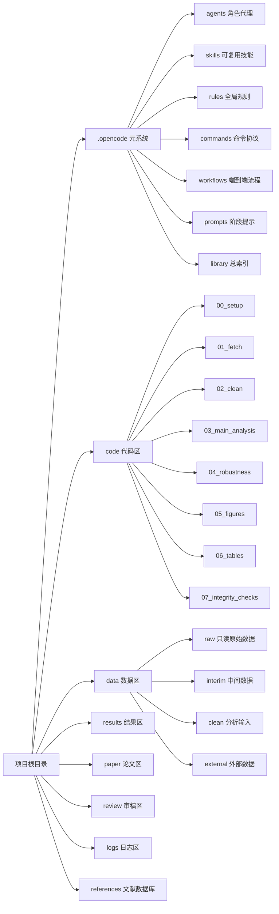
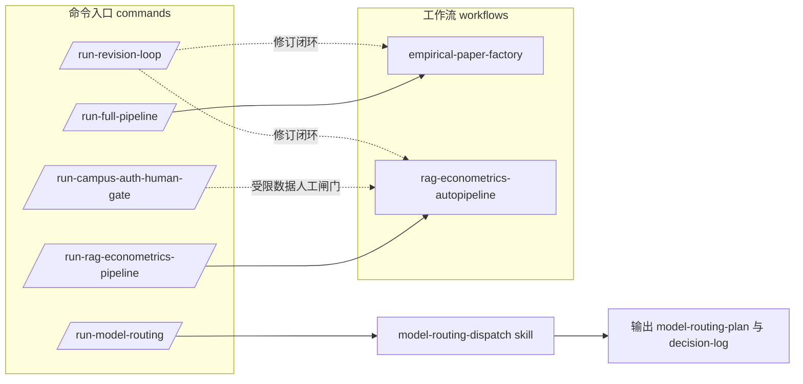
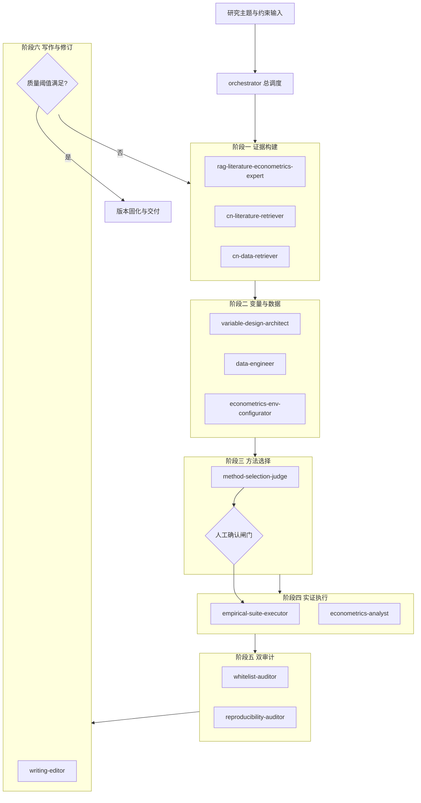
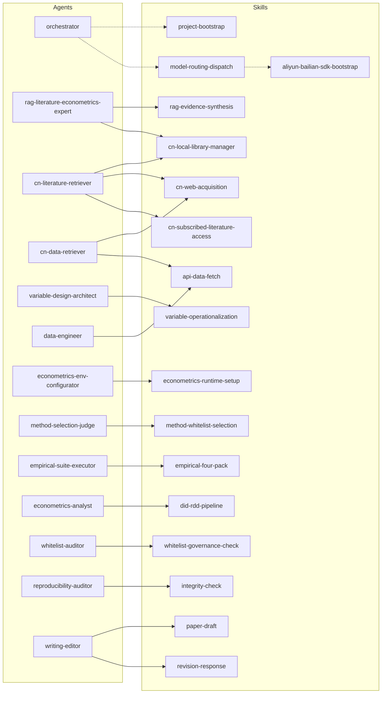
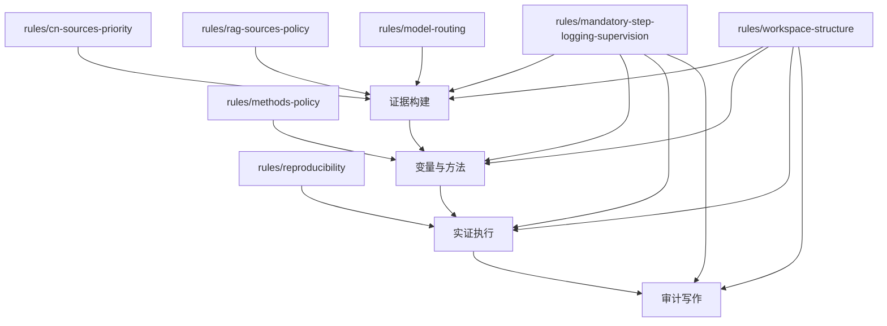

# opencode学术研究流程架构-手册-20260303-001

> 文档定位：本手册用于“从零理解该项目元系统”。
> 适用对象：项目负责人、科研执行人员、审计人员、后续接手同学。
> 范围：`.opencode` 元系统 + 工作区目录规则 + 命令入口 + 流程节点 + 角色协作 + 技能映射 + 规则约束。

---

## A. 先看总览：这个系统到底在解决什么问题？

这个项目不是“单一脚本仓库”，而是一个“科研流水线操作系统”：

- `workflows` 定义阶段顺序与迭代闭环；
- `commands` 定义触发入口与执行协议；
- `agents` 定义职责分工（谁负责什么）；
- `skills` 定义可复用能力（具体怎么做）；
- `rules` 定义边界条件（什么能做、什么不能做）；
- 工作区目录定义证据落点（产物必须写到哪里，才能可追溯）。

这套结构的核心价值，是把“科研流程”拆成可审计、可复现、可迭代的标准化节点，避免只有结论、没有证据链的问题。也就是说，项目追求的不是“写出一篇看起来像论文的文本”，而是“形成一条可复查的研究生产链”。

---

## B. 项目元数据与目录结构（职责视角）

### B.1 目录职责解释（为什么这么分层）

1. `code/` 是“执行逻辑层”，强调可复跑，不允许把最终结论直接塞进代码目录。
2. `data/` 是“数据状态层”，强调 `raw -> interim -> clean` 单向流。该规则对科研诚信非常关键：原始数据不能在中途被覆盖或隐式修改。
3. `references/` 是“文献状态层”，采用 `origin -> normal` 的分层：原始非结构化文献先进入 `origin`，规范化后进入 `normal` 并生成 `manifest`，确保文献来源可追溯。
3. `results/` 是“结果产物层”，图表、附录、汇总都在这里，便于论文与审稿复用。
4. `paper/` 是“论证文本层”，应该引用 `results/` 而不是手动编写数字。
5. `review/` 是“审稿协作层”，把意见输入、修订计划、回复稿拆开，避免口头协作造成信息丢失。
6. `logs/` 是“运行与审计轨迹层”，所有关键动作都应可追踪。

### B.2 子目录设计背后的治理逻辑

- `code/01_fetch` 与 `data/raw` 配套：确保“数据来源”可追溯。
- `code/02_clean` 与 `data/clean` 配套：确保“分析输入”有明确转换路径。
- `references` 与文献检索/授权技能配套：确保“题录—原文—权限—引用”可追溯。
- `code/03_main_analysis` 与 `code/04_robustness` 分离：防止主结果与稳健性检验混写导致口径混淆。
- `code/07_integrity_checks` 单独存在：强调完整性检查不是“可选项”，而是流程内建环节。

---

## C. 命令入口与工作流关系（触发视角）

### C.1 五条命令各自干什么

1. `/run-full-pipeline`：通用实证流水线入口，强调规划-执行-审阅-修订四段式。
2. `/run-rag-econometrics-pipeline`：RAG 驱动入口，强调文献证据矩阵与方法门禁。
3. `/run-campus-auth-human-gate`：面向订阅资源的人工授权闸门入口，解决“AI 无法自行合法登录”的现实约束。
4. `/run-revision-loop`：面向审稿周期的闭环入口，聚焦“意见—证据—改动映射”。
5. `/run-model-routing`：模型路由入口，解决“不同任务类型调用何种模型更合适”的效率问题。

### C.2 为什么命令层要单独存在

命令层把“操作意图”标准化，避免用户每次都写冗长自由文本导致执行不稳定。对于团队协作而言，命令层相当于“半结构化 API”：

- 参数可控，便于留痕；
- 协议固定，便于审计；
- 入口清晰，便于新同学接手。

---

## D. Agents 全流程协作图（组织视角）

### D.1 每个阶段的输入、输出、验收标准

#### 阶段一：证据构建

- 输入：研究主题、已有文献、已有数据目录。
- 输出：证据矩阵、研究空白地图、候选文献/数据清单。
- 验收：关键结论必须有来源；不能用无出处描述替代证据。

#### 阶段二：变量与数据

- 输入：证据矩阵、研究问题、可得数据。
- 输出：变量字典、数据源映射、清洗规则、风险注释。
- 验收：变量定义可观测、口径一致、来源可追溯。

#### 阶段三：方法选择

- 输入：变量设计、数据结构、识别假设。
- 输出：主方法+备选+兜底方案，以及人工确认记录。
- 验收：主方法在白名单内；前提与风险被明确披露。

#### 阶段四：实证执行

- 输入：已批准方法与 clean 数据。
- 输出：四件套结果（基准、机制、稳健性、异质性）与执行记录。
- 验收：脚本可重跑，失败尝试与修复过程有留痕。

#### 阶段五：双审计

- 输入：执行产物全集（代码、结果、文本、日志）。
- 输出：治理审计报告 + 学术审计报告。
- 验收：越权风险可解释，研究可信性问题可定位。

#### 阶段六：写作与修订

- 输入：双审计结果与实证结果。
- 输出：论文章节、审稿回复、改动映射表。
- 验收：结论与结果文件一致，修订逻辑可复查。

---

## E. Agents 与 Skills 映射（能力视角）

### E.1 角色与能力边界解读

1. `agent` 是“岗位角色”，强调职责边界与交付契约。
2. `skill` 是“能力模块”，强调可复用执行方案。
3. agent 可组合多个 skill，但不应突破自身职责边界。

例如：

- `cn-literature-retriever` 可以调用 `cn-web-acquisition`，也可以调用 `cn-subscribed-literature-access`，但它不能自行绕过人工授权门禁去抓取受限全文。
- `reproducibility-auditor` 可调用完整性检查能力，但它不负责“批准白名单权限”，那是 `whitelist-auditor` 的职权。

---

## F. 规则层在流程中的约束位置（合规视角）

### F.1 规则不是“建议”，而是“系统约束”

- `workspace-structure` 约束“写到哪里”；
- `reproducibility` 约束“如何保证可复现”；
- `mandatory-step-logging-supervision` 约束“每一步都要留痕”；
- `methods-policy` 约束“方法选择必须在白名单内并经过确认”；
- `cn-sources-priority` 与 `rag-sources-policy` 约束“证据来源质量与优先级”。

换句话说，规则层不是文档装饰，而是流程稳定性的根本来源。

---

## G. 节点详解（逐节点、逐关系，便于培训与交接）

> 本节对关键节点做详尽文字说明，覆盖“节点作用、输入输出、上下游关系、常见失败模式、修复建议”。

### G.1 工作流节点

#### 1) `empirical-paper-factory`

作用：标准线性主流程（规划→执行→审阅→修订）。

上游：`/run-full-pipeline`。

下游：`orchestrator` 主调度链。

常见失败模式：规划阶段无验收标准，后续执行发生口径漂移。

修复建议：在规划阶段强制写入“输入、输出、验收”三元组。

#### 2) `rag-econometrics-autopipeline`

作用：强调证据先行的流程，先做文献与数据证据矩阵，再做变量与方法。

上游：`/run-rag-econometrics-pipeline`。

下游：`rag-literature-econometrics-expert`、`variable-design-architect`、`method-selection-judge` 等。

常见失败模式：证据矩阵结构化不足，后续变量定义缺上下文。

修复建议：为证据矩阵增加固定字段模板（主题、对象、方法、变量、识别前提、结论、局限）。

### G.2 命令节点

#### 1) `/run-full-pipeline`

作用：通用“一键执行”入口。

输入：研究主题、数据范围、识别策略、语言。

输出：计划、代码、结果、审计、草稿。

风险：如果参数定义过于宽泛，执行链路会出现歧义。

#### 2) `/run-rag-econometrics-pipeline`

作用：RAG 专项入口。

关键点：必须包含方法白名单或使用默认白名单。

风险：跳过人工确认会导致方法切换不可审计。

#### 3) `/run-campus-auth-human-gate`

作用：订阅数据/文献的合规授权门禁。

关键点：AI 预处理 + 人工认证 + AI 后处理。

风险：若省略人工环节，可能触发合规风险与版权风险。

#### 4) `/run-revision-loop`

作用：把审稿意见变成“可执行修订任务包”。

关键点：必须形成“意见-响应-改动位置”映射。

#### 5) `/run-model-routing`

作用：让模型选择决策显式化。

关键点：输出路由决策日志，不再“黑盒换模型”。

### G.3 Agent 节点

#### 1) `orchestrator`

作用：系统总调度。

边界：只做计划、分派、整合，不替代专业子代理的细节工作。

失败信号：直接跳过阶段、无验收标准、无回传格式。

#### 2) `rag-literature-econometrics-expert`

作用：把文献证据转化为结构化证据库与研究空白。

边界：不能凭空补证据。

#### 3) `cn-literature-retriever`

作用：中文文献获取与管理。

关键关系：
- 本地先走 `cn-local-library-manager`；
- 开放来源走 `cn-web-acquisition`；
- 订阅来源走 `cn-subscribed-literature-access` + 人工授权。

#### 4) `cn-data-retriever`

作用：中文数据来源盘点与联网补充。

硬约束：不能改写 `data/raw`。

#### 5) `variable-design-architect`

作用：概念到变量的操作化设计。

关键价值：减少“变量定义看起来合理但不可观测”的问题。

#### 6) `data-engineer`

作用：数据获取、清洗、字典与质量检查。

关键风险：未记录样本删减理由。

#### 7) `econometrics-env-configurator`

作用：Python/R/Stata 运行时配置。

关键价值：把环境问题前置，避免回归阶段才暴露缺依赖。

#### 8) `method-selection-judge`

作用：在白名单内做方法排序与风险披露。

关键关系：必须经过人工确认闸门后生效。

#### 9) `empirical-suite-executor`

作用：执行实证四件套，强调“已批准方法”的执行而非重新设计。

#### 10) `econometrics-analyst`

作用：识别策略实现、稳健性与可视化说明。

原则：先事实后解释，统计显著不等于经济显著。

#### 11) `whitelist-auditor`

作用：治理审计（权限、越权、签发、回滚建议）。

边界：不判断研究结论正确性。

#### 12) `reproducibility-auditor`

作用：学术可信性审计（数字一致性、选择性报告、可复现性）。

边界：不负责权限签发。

#### 13) `writing-editor`

作用：把分析证据转为论文文本与审稿回复。

关键约束：结论必须落到图表编号与结果路径。

### G.4 Skill 节点（关键能力包）

#### 1) `project-bootstrap`

项目初始化能力，产出目录与约束骨架。

#### 2) `rag-evidence-synthesis`

RAG 证据综合能力，负责证据矩阵构建。

#### 3) `cn-local-library-manager`

本地文献与数据资产管理能力，优先级最高。

#### 4) `cn-web-acquisition`

开放在线资源抓取能力；遇订阅库需转交订阅技能。

#### 5) `cn-subscribed-literature-access`

订阅中文库访问能力，强调人工授权交互与合规留痕。

#### 6) `api-data-fetch`

公开 API 拉数能力，含小样本试拉与批量拉取建议。

#### 7) `variable-operationalization`

变量操作化能力，提供替代指标与口径风险控制。

#### 8) `econometrics-runtime-setup`

三语言运行时配置能力（Python 主工程，R 主计量，Stata 备用）。

#### 9) `method-whitelist-selection`

方法白名单匹配与闸门能力。

#### 10) `empirical-four-pack`

四件套执行能力模板。

#### 11) `did-rdd-pipeline`

因果识别专项能力（DiD/RDD 及扩展检验）。

#### 12) `whitelist-governance-check`

治理审计能力。

#### 13) `integrity-check`

研究诚信与一致性检查能力。

#### 14) `paper-draft`

论文草稿生成能力。

#### 15) `revision-response`

审稿回复材料生成能力。

#### 16) `model-routing-dispatch`

模型路由决策能力。

#### 17) `aliyun-bailian-sdk-bootstrap`

百炼 SDK 与 key 文件接入能力。

### G.5 关键协作关系（谁依赖谁）

1. `orchestrator -> 全体子代理`：负责阶段边界与交付格式统一。
2. `cn-literature-retriever -> cn-web-acquisition -> cn-subscribed-literature-access`：形成“开放优先、订阅转闸门”的合规链。
3. `method-selection-judge -> 人工确认 -> empirical-suite-executor`：防止方法漂移。
4. `empirical-suite-executor <-> econometrics-analyst`：执行与解释分工协作。
5. `whitelist-auditor || reproducibility-auditor`：并行双审计，治理与学术互不替代。
6. `writing-editor <- 双审计结果`：将风险披露显式反映到正文与回复中。

---

## H. 常见问题与排障建议

### H.1 “有论文文本，但证据链断裂”

症状：章节完整，但找不到对应结果文件或脚本。

排查：
- 检查 `paper/` 的数字是否来自 `results/`；
- 检查 `code/` 是否存在对应脚本；
- 检查 `logs/run` 是否有执行轨迹。

修复：
- 缺脚本则补脚本；
- 缺结果则重跑并落盘；
- 缺日志则补留痕并标记重建来源。

### H.2 “方法被偷偷切换”

症状：方法选择记录与执行脚本不一致。

排查：
- 对照 `review/plan/method-selection-decision.md` 与实际执行脚本。

修复：
- 回滚到人工确认方法；
- 在日志中记录偏差与修复动作。

### H.3 “订阅文献获取不稳定”

症状：时好时坏，或者被站点限制。

排查：
- 是否经过人工授权门禁；
- 是否超出站点速率限制；
- 是否误把受限全文写入公开目录。

修复：
- 统一走授权门禁；
- 限速并记录失败重试；
- 把受限全文迁回受限目录并更新 manifest。

---

## I. “极简单图”12 节点版（适合 README 首页）

### I.1 12 节点的含义（首页短注释）

- 节点 1-2：输入与总调度。
- 节点 3-4：证据先行（文献+数据）。
- 节点 5-7：变量与方法决策，且必须有人类确认。
- 节点 8：执行四件套。
- 节点 9-10：双审计。
- 节点 11：写作与审稿修订。
- 节点 12：交付或回环重做。

---

## J. 一句话总括

这套系统的本质是：用“命令化入口 + 角色化分工 + 技能化复用 + 规则化约束 + 目录化留痕”把学术研究从一次性产出，改造成可复查、可复跑、可迭代的工程化流程。
