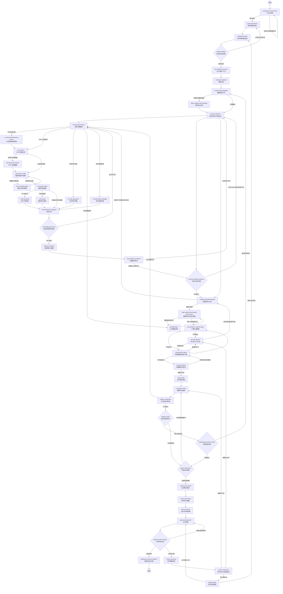

# 学术科研工作流技能映射与静态流程图设计-思考-20260312-001

## 1. 任务目标

本次设计分成两层：

1. 先把 AOK 的 Agent 技能与 ARK 的逻辑技能做成可对照的技能资产表与关系矩阵。
2. 再借用 AOK 静态节点图的思路，把技能节点组织成一个可回环、可判定、可结束的学术科研工作流静态流程图。

本稿采用“逻辑技能”作为最小统计单元，而不是直接按 Python 文件数统计。原因是 ARK 侧的 `academicresearch_kit/skills/cnki_bridge.py` 实际暴露了 10 个独立逻辑技能；如果按文件数统计，会把多对一关系误判为结构性缺失。

## 2. 参考的 AOK 静态图结构

本稿借用的是 AOK 的静态图建模方式，而不是直接复刻既有业务图。参考依据有两类：

1. `autodokit/examples/flow_graph_compile_example.py`：说明 AOK 的静态图核心对象是节点与边，边负责承载流向。
2. `demos/output/runtime_v3_dry_run/graph_registry/graphs.json`：说明 AOK 图注册后的关键字段包括 `node_uid`、`affair_uid`、`base_tendency_score`、`condition_expr`、`enabled` 等。

因此，本次学术科研流程图也遵循同样的建模原则：

1. 节点：默认等于一个 Agent 技能。
2. 边：必须显式说明流转条件。
3. 图：允许回环，不强制做 DAG。
4. 结束：只有在目标满足、审计通过或终止条件明确时才流向结束节点。

## 3. 技能资产盘点结论

### 3.1 数量结论

| 项目 | 结果 |
|---|---|
| Agent 现有逻辑技能数 | 43 |
| ARK 现有逻辑技能数 | 36 |
| 当前精确一一映射 | 35 |
| 当前别名一一映射 | 1 |
| 当前部分替代映射 | 5 |
| 当前空关系 | 2 |
| 为补全矩阵新增的 ARK 占位技能 | 7 |
| 为真实学术流程新增的共享占位技能 | 4 |
| 补全后 Agent 技能总数 | 47 |
| 补全后 ARK 技能总数 | 47 |
| 补全后一一映射数 | 47 |

### 3.2 当前映射结论

当前关系并不是完全失衡，而是“主体已对齐、少数高层认知技能与写作审稿技能未脚本化”。

当前最关键的 8 个非精确关系如下：

| Agent 技能 | 当前 ARK 对应 | 判断 |
|---|---|---|
| ark-workflow-executor | workflow | 别名关系，语义一致但名称未统一 |
| research-ideation | rag-evidence-synthesis + method-whitelist-selection + variable-operationalization | 组合替代，不是单一技能 |
| cn-subscribed-literature-access | retrieval-governance + cnki-paper-detail + cnki-download + cnki-export | 组合替代，但缺少“人工授权门禁”总封装 |
| ml-paper-writing | paper-draft + rag-evidence-synthesis | 组合替代，但缺少整稿编排器 |
| results-analysis | did-rdd-pipeline + empirical-four-pack + rag-evidence-synthesis | 组合替代，但缺少结果叙述总封装 |
| review-response | revision-response | 只覆盖逐条回复，不覆盖意见拆解与证据映射全链条 |
| citation-verification | 无稳定对应 | 空关系 |
| paper-self-review | 无稳定对应 | 空关系 |

### 3.3 补全策略

为了把矩阵尽量收敛到一一映射，本稿建议做两类补全：

1. ARK 侧补齐 7 个占位逻辑技能：`citation-verification`、`cn-subscribed-literature-access`、`ml-paper-writing`、`paper-self-review`、`research-ideation`、`results-analysis`、`review-response`。
2. Agent 与 ARK 双侧同时补齐 4 个流程必需但当前缺位的共享占位技能：`data-engineering-sample-construction`、`journal-submission`、`external-review-intake`、`publication-archive-release`。

补全后的目标不是“全部立刻可执行”，而是先形成完整稳定的技能契约，再决定哪些需要真正脚本化。

## 4. 学术科研静态流程图设计原则

### 4.1 设计原则

1. 主流程符合正常学术科研活动：选题、检索、设计、数据、分析、写作、投稿、外审、修订、归档。
2. 图必须允许回环：研究设计、证据获取、分析稳健性、写作修改都允许回退。
3. 节点默认尽量复用现有 Agent 技能。
4. 仅在现有技能无法承载真实流程语义时，才新增占位技能。
5. 治理、调度、审计节点不是装饰，而是决定能否继续流转的硬节点。

### 4.2 新增共享占位技能

| 技能名 | 作用 | 新增原因 |
|---|---|---|
| data-engineering-sample-construction | 数据清洗、样本构建、变量表与分析底表生成 | 当前缺少把“变量设计”与“实证运行”连接起来的中间节点 |
| journal-submission | 目标期刊投递、投稿包生成、版本登记 | 当前没有正式“投稿”节点 |
| external-review-intake | 接收外审决定与审稿意见包 | 当前缺少“外部反馈进入系统”的专门节点 |
| publication-archive-release | 终稿归档、复现包发布、项目封存 | 当前缺少正式结束前的归档节点 |

### 4.3 技能节点也可以承担判断节点语义

这里需要明确一点：Agent 技能不应被狭义理解成“只会执行动作的事务节点”。在学术科研工作流里，很多技能天然同时承担两层职责：

1. 先执行一次分析、校验、筛选或审计。
2. 再根据输出结果决定下一条边应该流向哪里。

因此，技能节点既可以是“执行节点”，也可以是“判断节点”。

典型例子包括：

1. `taskdb-validate`：先校验任务库，再决定是进入 workflow 还是回退重建。
2. `knowledge-prescreen`：先筛文献，再决定是进入精读还是回到检索治理。
3. `method-whitelist-selection`：先做方法白名单判断，再决定是继续设计还是回退选题。
4. `integrity-check`：先做合规审计，再决定是否进入治理签发。
5. `paper-self-review`：先做内部审稿，再决定是否具备投稿条件。
6. `external-review-intake`：先读取外审决定，再决定是接收归档、退修还是转投。

所以在下面的静态流程图中，我把这类“执行后立刻分流”的技能直接视为判断节点来画；这比把判断逻辑拆成额外空白节点更贴近真实科研流程。

## 5. 学术科研工作流静态流程图

说明：

1. 下图中的 `*` 表示本次新增的占位技能。
2. 这是一张完整图，不是分层拆分图。
3. 图中显式保留了检索回环、方法回环、分析回环、审稿回环四类核心回路。
4. 方框表示以执行为主的技能节点，花括号表示“执行后立即判定去向”的技能节点。

## 6. 流程图解释

### 6.1 主线

主线可以概括为：

1. 启动与治理准备。
2. 研究构思与检索治理。
3. 文献获取、入库、预筛与阅读。
4. 研究设计、变量设计、数据工程。
5. 主分析、稳健性与结果解释。
6. 草稿生成、整稿写作、引文与合规审计。
7. 投稿、外审接收、回复修订、再次投稿。
8. 接收后归档发布并结束。

### 6.2 关键回环

1. `knowledge-prescreen -> retrieval-governance`：文献不相关时回到检索治理重选来源与策略。
2. `rag-evidence-synthesis -> research-ideation`：证据矩阵不足以支撑研究空白时回到选题。
3. `did-rdd-pipeline -> variable-operationalization`：识别前提不稳时回到变量或口径设计。
4. `empirical-four-pack -> did-rdd-pipeline`：稳健性不够时回到主规格。
5. `paper-self-review -> ml-paper-writing`：内审发现结构与逻辑问题时回写。
6. `revision-response -> did-rdd-pipeline`：审稿意见要求补分析时回到实证。
7. `revision-response -> ml-paper-writing`：审稿意见要求改写时回到写作。
8. `taskdb-replay -> taskdb-bootstrap`：回放发现流转记录异常时，回到任务库与模板修正。

### 6.3 为什么期刊检索节点放在投稿前

这里把 `cnki-journal-search`、`cnki-journal-index`、`cnki-journal-toc` 放在投稿前，不是把它们当作文献检索节点，而是把它们当作“目标期刊侦察节点”使用：

1. 先筛期刊定位。
2. 再看收录与评价。
3. 再核对刊期与栏目口径。
4. 最后再进入正式投稿。

这种用法能让原本偏期刊情报的技能也进入真实学术工作流，而不是被孤立。

## 7. 产物说明

完整清单与矩阵见附录文档：

1. `.github/notes/think/think-学术科研工作流技能映射与静态流程图附录-20260312-002.md`

附录包含：

1. 【Agent 技能表】
2. 【ARK 技能表】
3. 【当前 Agent 技能与 ARK 技能关系矩阵】
4. 【补全后的 Agent 技能与 ARK 技能关系矩阵】
5. 【新的 Agent 技能表】
6. 【占位用的新技能清单】
7. 【未被使用的技能清单】

## 8. 结论

结论很明确：

1. AOK 的 Agent 技能体系已经足以拼出一条完整的学术科研流程主干。
2. 当前真正缺的不是底层检索或实证节点，而是高层研究构思、写作统筹、审稿策略和收尾归档节点。
3. 若先补齐 7 个 ARK 占位技能，再补 4 个流程型共享占位技能，就可以把现有体系收敛成一套 47 对 47 的近乎完全一一映射结构。
4. 在此基础上，后续既可以把本稿 Mermaid 静态图继续编译成 AOK 风格的节点图，也可以反向驱动 ARK 的 workflow.json 设计。