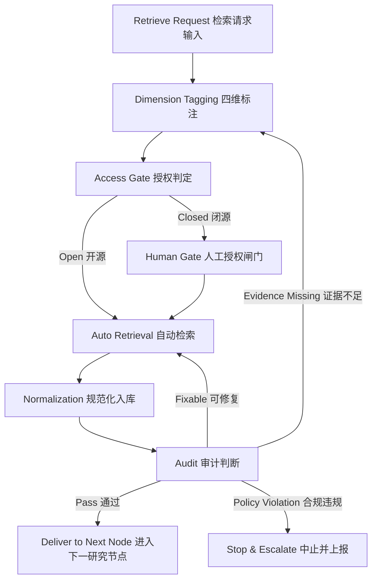

# 检索子流程设计-思考-20260305-001

## 1. 设计目标

本文件定义学术科研流程中的【检索】子流程，重点解决四维差异导致的流程分化问题：

1. 文献 vs 数据
2. 离线 vs 在线
3. 国内 vs 国外
4. 开源 vs 闭源

四维笛卡尔积共 16 种组合。设计目标是：在不牺牲可执行性的前提下，统一流程框架、统一审计口径、统一回退机制。

---

## 2. 总体原则

1. 文献与狭义数据并列建模，不混为一个节点。
2. 16 种组合共享同一状态机模板，不为每种情况造一套独立系统。
3. 闭源场景必须经过人工授权闸门。
4. 检索完成后必须走规范化与审计，不允许“检索即入主分析”。
5. 审计结果决定路由去向（继续/回退/中止），而不是仅记录。

---

## 3. 统一状态机模板（适配16组合）

### 图外说明

1. `R1` 负责打四维标签，确定具体组合类型。
2. `R2` 是关键分叉：开源可自动执行，闭源必须进人工授权闸门。
3. `R4` 做统一规范化，保证后续流程读取一致。
4. `R5` 的审计结果必须驱动路由，不允许“失败也继续”。

---

## 4. 四维组合矩阵（16种）

## 4.1 文献检索（8种）

| ID | 类型 | 组合 | 主渠道示例 | 是否人工闸门 |
|---|---|---|---|---|
| L1 | 文献 | 离线-国内-开源 | 本地OA文献库、已上传PDF | 否 |
| L2 | 文献 | 离线-国内-闭源 | 本地订阅来源文献 | 是 |
| L3 | 文献 | 离线-国外-开源 | 本地arXiv/开放期刊PDF | 否 |
| L4 | 文献 | 离线-国外-闭源 | 本地付费数据库导出 | 是 |
| L5 | 文献 | 在线-国内-开源 | 中文开放平台、机构OA | 否 |
| L6 | 文献 | 在线-国内-闭源 | CNKI/万方/维普订阅内容 | 是 |
| L7 | 文献 | 在线-国外-开源 | OpenAlex/arXiv/PubMed OA | 否 |
| L8 | 文献 | 在线-国外-闭源 | 出版社付费库 | 是 |

## 4.2 数据检索（8种）

| ID | 类型 | 组合 | 主渠道示例 | 是否人工闸门 |
|---|---|---|---|---|
| D1 | 数据 | 离线-国内-开源 | 用户本地公开数据文件 | 否 |
| D2 | 数据 | 离线-国内-闭源 | 用户本地商业库/内部数据 | 是 |
| D3 | 数据 | 离线-国外-开源 | 本地国际公开数据快照 | 否 |
| D4 | 数据 | 离线-国外-闭源 | 本地付费国际数据库导出 | 是 |
| D5 | 数据 | 在线-国内-开源 | 统计局/政府公开接口 | 否 |
| D6 | 数据 | 在线-国内-闭源 | Wind/CSMAR/CNRDS在线访问 | 是 |
| D7 | 数据 | 在线-国外-开源 | World Bank/OECD/公开API | 否 |
| D8 | 数据 | 在线-国外-闭源 | 付费国际数据库 | 是 |

---

## 5. 子流程模板（每个组合都复用）

每个组合按以下 6 步执行：

1. 检索计划：定义目标、关键词、时间窗、来源池。
2. 授权判定：判定开源/闭源，闭源触发人工闸门。
3. 检索执行：自动抓取或人工下载后回填。
4. 规范化入库：去重、重命名、元数据补齐、manifest更新。
5. 审计判定：按文献/数据类型执行差异化审计。
6. 路由输出：通过进入下一节点，失败按规则回退。

---

## 6. 文献链与数据链的差异化审计

## 6.1 文献审计（Literature Audit）

必查项：

1. 来源可信等级（A/B/C）。
2. 原文可得性（全文/摘要/题录）。
3. 引用可追溯性（DOI、题录字段完整度）。
4. 与研究问题/方法的覆盖度。
5. 冲突文献是否显式记录。

失败回退：

1. 元数据缺失 -> 回检索执行补齐。
2. 原文缺失且为关键证据 -> 回维度标注，转闭源或替代源。
3. 来源不合规 -> 中止并上报审计。

## 6.2 数据审计（Data Audit）

必查项：

1. 授权与使用边界（是否允许研究使用）。
2. 口径一致性（单位、时间、地域、字段定义）。
3. 数据完整性（缺失率、异常值、重复）。
4. 可复现链路（raw -> interim -> clean）。
5. 可识别性支持（关键变量是否可观测）。

失败回退：

1. 口径不一致 -> 回规范化处理。
2. 关键变量缺失 -> 回检索计划扩源或回研究设计重定义变量。
3. 授权不通过 -> 中止并上报审计。

---

## 7. 与现有命令/代理/技能映射（建议）

## 7.1 文献侧

1. `run-scholar-research-init`：文献检索启动与证据矩阵入口。
2. `run-scholar-zotero-review`：集合综述与证据聚合。
3. `run-scholar-zotero-notes`：结构化阅读笔记。
4. `cn-literature-retriever`：中文文献检索主代理。
5. `rag-evidence-synthesis`：证据综合技能。

## 7.2 数据侧

1. `run-rag-econometrics-pipeline`：数据与实证主链入口。
2. `data-engineer`：数据接入、清洗、字段对齐。
3. `api-data-fetch`：公开数据接口拉取。
4. `cn-web-acquisition`：中文网页采集与提取。

## 7.3 闭源闸门

1. `run-campus-auth-human-gate`：闭源在线访问统一人工门。
2. 输出：下载队列、下载状态、过程日志。

---

## 8. 标准产物路径

## 8.1 文献产物

1. 原始层：origin
2. 规范层：bib、fulltext、notes
3. 台账层：literature-manifest.json
4. 日志层：logs

## 8.2 数据产物

1. 原始层：raw
2. 中间层：interim
3. 清洗层：clean
4. 执行日志：run
5. 审计日志：audit

---

## 9. 审计结果码与路由规则

建议统一结果码：

1. `PASS`：通过，进入下一研究节点。
2. `RETRY`：可修复，回检索执行重试。
3. `BACKTRACK`：需要回上游重选来源或重定维度。
4. `BLOCKED`：授权/合规阻断，进入人工处置。

---

## 10. 最小可执行结论

1. 16 种组合本质上是“16条路由”，不是“16套流程系统”。
2. 统一状态机 + 差异化审计 + 闭源人工门，可以同时保证灵活性和治理性。
3. 文献链服务“问题与方法正当性”，数据链服务“识别与估计有效性”，两者在研究设计与结果解释节点汇合。

---

## 11. 与知识管理 K1 的边界与接口（补充）

### 11.1 是否重合：结论

`检索` 与 `K1 知识采集` 相关但不重合，关系是“上游供给 -> 下游接收”。

1. 检索流程职责：发现、拉取、导入原始对象（文献原文、题录、数据文件）。
2. K1 职责：接收原始对象并形成知识资产采集记录（包含来源、主题、方法标签、可复用标记）。
3. 检索可独立运行；K1 必须依赖检索或已有离线资产输入。

### 11.2 边界定义

检索流程做到为止：
1. 原始获取（在线下载 / 离线导入）。
2. 基础规范化（命名、去重、manifest 基础更新）。
3. 合规留痕（授权状态、下载日志）。

K1 开始负责：
1. 采集条目化（对象 -> 知识条目）。
2. 语义标签化（主题、方法、变量、场景）。
3. 进入知识管理状态机（K1 -> K2 -> ...）。

### 11.3 检索到 K1 的输入契约（建议）

建议检索输出统一对象 `retrieval_bundle`，字段至少包含：

1. `bundle_id`
2. `object_type`（literature/data）
3. `source_type`（online/offline, cn/int, open/closed）
4. `file_paths`
5. `manifest_patch`
6. `permission_status`
7. `result_code`

K1 只消费 `result_code=PASS` 或 `RETRY后PASS` 的 bundle；`BLOCKED` 只进入候选池不得入库。
