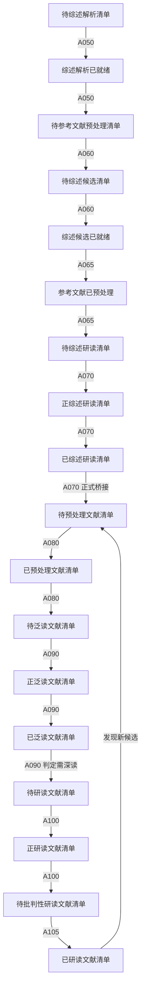

# 综述与普通文献阅读状态机理论模型与极简实现-设计-20260413-001

## 一、文档定位

本文给出当前 AcademicResearch-auto-workflow 中“综述文献链 + 普通文献链”的统一阅读状态机理论模型与极简工程实现口径。

它要回答五个问题：

1. 综述文献和普通文献为什么不能混用同一套当前态字段。
2. A050-A070 与 A080-A105 各自管理的文献条目清单到底是什么。
3. A070 为什么会生成多种候选导出件，以及这些导出件为什么不能被理解成正式跳步。
4. 当前正式状态机和导出层清单之间的边界是什么。
5. 在不引入过度复杂引擎的前提下，如何以 `content.db + tasks.db + aok_log.db + workspace/tasks` 落一个可追溯、可回退、可继续推进的极简实现。

本文是对旧稿 `design-普通文献泛读研读状态机理论模型与极简实现-20260405-001` 的正式替代说明。旧稿主要讨论 A080 之后的普通文献链，未覆盖 A050-A070 的综述链与 A070 的正式桥接语义，因此不再适合作为当前总口径。

## 二、当前正式结论

### 2.1 不是一条单链，而是两套状态机 + 一条桥接规则

当前正式口径不是“所有文献沿一条队列一路往下跑”，而是三层结构：

1. 综述文献状态机：A050 -> A060 -> A065 -> A070，对应 `literature_review_state`。
2. 普通文献状态机：A080 -> A090 -> A095 -> A100 -> A105，对应 `literature_reading_state`。
3. A070 桥接规则：把综述链识别出来的普通文献候选，转成普通文献链可消费的正式当前态。

### 2.2 真相源和导出层必须分开理解

当前正式真相源是：

1. `workspace/database/content/content.db`
2. `workspace/database/tasks/tasks.db`
3. `workspace/database/logs/aok_log.db`

其中与阅读推进最相关的是两张当前态表：

1. `literature_review_state`：综述链当前态。
2. `literature_reading_state`：普通文献链当前态。

CSV、Markdown、JSON 清单仍然存在，但它们只属于：

1. 审计导出件
2. 可读视图
3. 任务目录副产物

不能把历史导出字段或阅读建议字段误认为就是正式当前态。

### 2.3 A070 只正式交给 A080，不直接交给 A090

这是当前最容易被误解的地方。

A070 的任务目录里可能会保留多种候选导出件，例如：

1. `must_read_originals.csv`
2. `review_general_reading_list.csv`

再把它们合并成：

1. `downstream_non_review_candidates.csv`

所以你会看到同一批 5 篇综述，最终导出几十条甚至更多普通文献候选。这是因为导出对象不是“5 篇综述本身”，而是“这 5 篇综述引用过并成功映射到主库的原始文献”。

这些导出件可以表达不同的候选来源、优先级或阅读建议，但都不应被解释为正式阶段分流。

正式解释是：

1. A070 识别出的普通文献候选，应统一桥接到 A080。
2. A080 完成预处理与标准化后，这些条目才顺序进入 A090。
3. 正式当前态桥接仍然只以 `literature_reading_state` 为准。
4. 因而，导出件中的分类、排序或建议，不应覆盖正式状态机主线。

### 2.4 当前工程上的最小一致口径

当前最小一致口径应写成：

1. A050-A070 负责统一文献预处理解析、综述候选构建、研究地图与普通文献候选识别。
2. A080-A105 负责普通文献的预处理、泛读、深读资产准备与批判性研读。
3. A070 的正式桥接是把普通文献对象写进 `literature_reading_state` 并交给 A080。
4. A090 只能理解为 A080 之后的正式下一层，而不是 A070 的直接出口。

## 三、双层阅读的理论模型

### 3.1 综述阅读的本质

综述阅读不是把综述当成“普通文献的第一篇”，而是把综述作为：

1. 研究地图校准器
2. 领域问题意识提炼器
3. 原始文献候选发现器
4. 主题级分析骨架更新器

因此，综述链的核心任务不是“把综述本身读完”，而是：

1. 形成研究脉络
2. 形成核心成果、共识点、争议点、未来方向、知识框架
3. 根据综述参考文献发现应继续进入普通链的原始文献对象

### 3.2 普通文献阅读的本质

普通文献链回答的是另一组问题：

1. 这篇文献是否值得继续深读。
2. 它能否补强或推翻当前主题级判断。
3. 它的证据链是否足以进入正式知识回写。
4. 它是否会再引出新的补检、补件或新候选。

因此，普通文献链内部仍然保留“泛读 -> 深读资产准备 -> 批判性研读”的分层结构。

### 3.3 两层阅读如何衔接

综述链和普通链并不是“高层阅读”和“低层阅读”的关系，而是：

1. 综述链负责校准研究外部地图。
2. 普通链负责逐篇建立正式证据链。
3. A070 是两者之间的桥接器，而不是一个把所有候选直接推进到底的万能节点。

## 四、综述文献状态机

### 4.1 正式真相源

综述文献当前态正式写入：

1. `literature_review_state`

### 4.2 核心字段

当前正式核心字段如下：

1. `pending_review_candidate`
2. `review_candidate_ready`
3. `pending_review_parse`
4. `review_parse_ready`
5. `pending_reference_preprocess`
6. `reference_preprocessed`
7. `pending_review_read`
8. `in_review_read`
9. `review_read_done`
10. `review_read_count`

### 4.3 最小状态转移

推荐最小转移如下：

1. A050：`pending_review_parse -> review_parse_ready + pending_reference_preprocess`
2. A060：`pending_review_candidate -> review_candidate_ready + pending_review_parse`
3. A065：`pending_reference_preprocess -> reference_preprocessed + pending_review_read`
4. A070：`pending_review_read -> in_review_read -> review_read_done`

### 4.4 统一状态机图

### 4.5 综述链的任务职责

#### A050

1. 承接统一文献预处理解析。
2. 生成综述解析资产并推进状态。
3. 把条目写入 `review_parse_ready=1` 与 `pending_reference_preprocess=1`。

#### A060

1. 构建综述候选视图。
2. 解释候选排序与可读视图。
3. 把条目推进到 `pending_review_parse=1`。

#### A065

1. 做参考文献扫描、修复、映射。
2. 建立标准笔记骨架。
3. 把条目推进到 `pending_review_read=1`。

#### A070

1. 对综述做结构化研读。
2. 形成主题级综合资产。
3. 识别普通文献候选并桥接到普通链。

## 五、普通文献状态机

### 5.1 正式真相源

普通文献当前态正式写入：

1. `literature_reading_state`

### 5.2 核心字段

当前正式核心字段如下：

1. `pending_preprocess`
2. `preprocessed`
3. `pending_rough_read`
4. `in_rough_read`
5. `rough_read_done`
6. `pending_deep_read`
7. `in_deep_read`
8. `deep_read_decision`
9. `deep_read_done`
10. `deep_read_count`

### 5.3 最小状态转移

推荐最小转移如下：

1. A080：`pending_preprocess -> preprocessed + pending_rough_read`
2. A090：`pending_rough_read -> in_rough_read -> rough_read_done`，并按条件写 `pending_deep_read=1`
3. A095：消费 `rough_read_done=1 AND analysis_batch_synced=0`，补写批次分析，不单独改变主状态层级
4. A100：`pending_deep_read -> in_deep_read -> deep_read_decision=parse_ready`
5. A105：消费 `deep_read_decision=parse_ready`，收口为 `deep_read_done=1`

### 5.4 图示读取说明

普通文献链不再单独画第二张状态机图，统一使用上面的“统一状态机图”读取。图中的普通文献段从 `待预处理文献清单` 开始，到 `已研读文献清单` 收口。

## 六、A070 的正式桥接模型

### 6.1 为什么 5 篇综述能导出几十篇普通文献

因为 A070 的下游对象不是“综述本身”，而是“综述引用过并成功映射回主库的原始文献”。

最小运算链如下：

1. 读取 A065 推送给 A070 的 5 篇综述。
2. 扫描综述中的参考文献并建立 `reference_citation_mapping`。
3. 过滤掉解析失败、明显错配和综述自身。
4. 在主库里补齐 `uid_literature/cite_key/title` 等身份信息。
5. 再整理成若干候选导出件与审计清单。

### 6.2 候选导出件的正确理解

如果任务目录里存在 `review_priority_candidates.csv`、`review_reference_candidates.csv`、`a080_seed_candidates.csv`（以及历史兼容文件 `must_read_originals.csv`、`review_general_reading_list.csv`、`downstream_non_review_candidates.csv`），它们的正确理解是：

1. 它们是 A070 运行后的审计导出件。
2. 它们可以表达候选来源、优先级、阅读建议或人工巡检辅助信息。
3. 它们不等于正式阶段分流，不应被解释为 A070 直接把对象送入 A090。

### 6.3 为什么会有重叠

同一篇文献可能同时满足多种候选特征：

1. 是高置信必读原始文献。
2. 也是值得保留的一般延伸阅读。

因此，在混合导出件中，同一篇文献可能因为不同的候选解释被重复列出。但这只属于导出层重复，不等于当前态层多次推进。

### 6.4 正式不跳步的含义

当前正式不跳步，应理解为：

1. A070 正式桥接到 A080。
2. A080 完成预处理后，条目才进入 A090 的正式当前态。
3. 历史导出件中若存在类似 `preferred_next_stage=A090` 的字段，只能解释为遗留导出字段或阅读建议字段，不应解释为“综述链直接推进成 A090 当前态”。

### 6.5 当前极简实现建议

在工程实现上，A070 的最小一致收口方式应是：

1. 综述链收口：把综述对象写成 `review_read_done=1`。
2. A080 桥接：把 A070 识别出的普通文献候选统一 upsert 到 `literature_reading_state.pending_preprocess=1`，或在资产齐备时写 `pending_rough_read=1`。
3. 审计导出：保留候选清单、阅读建议清单和混合导出件，用于人工巡检、兼容导出或后续显式 seed。
4. gate 收口：写 `gate_review.json` 与统一后处理摘要。

## 七、极简实现的数据库与任务目录口径

### 7.1 content.db

当前最关键的最小表集合是：

1. `literatures`
2. `literature_parse_assets`
3. `knowledge_notes`
4. `knowledge_literature_links`
5. `literature_review_state`
6. `literature_reading_state`

### 7.2 tasks 目录

每个事务应创建独立任务目录：

1. `workspace/tasks/<yyyymmddHHMMSS-节点代号>/`

至少包含：

1. `task_manifest.json`
2. `gate_review.json`
3. 导出件、审计件、handoff 清单

### 7.3 logs

统一写入：

1. `workspace/database/logs/aok_log.db`

记录：

1. 节点开始/结束
2. gate 摘要
3. 人工决策
4. 异常与失败原因

## 八、与旧稿的关系

旧稿 `design-普通文献泛读研读状态机理论模型与极简实现-20260405-001` 的主要价值仍在于：

1. 把普通文献阅读抽象为泛读与研读两层。
2. 强调标准文献笔记、分析笔记与创新点笔记的分层。

但它当前已经不足以作为总口径，原因是：

1. 没纳入 A050-A070 综述链。
2. 没把 `literature_review_state` 纳入统一状态机。
3. 没解释 A070 的正式桥接与审计导出件边界。
4. 没覆盖当前 `content.db + tasks.db + aok_log.db` 的极简工程实现边界。

因此，今后讨论“文献条目清单状态机”时，应优先以本文为准。

## 九、最终结论

当前正式状态机应压缩理解为一句话：

**综述文献先在 `literature_review_state` 中完成 A050-A070 的候选、解析、参考文献预处理与综述研读收口；A070 再把从综述参考文献中识别出的普通文献候选统一正式桥接到 A080，随后普通文献继续沿 A080-A105 的预处理、泛读、深读资产准备与批判性研读主链顺序推进；任务目录中的候选分类文件只属于审计导出件，不改变正式状态机。**