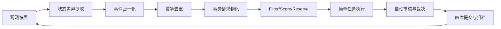
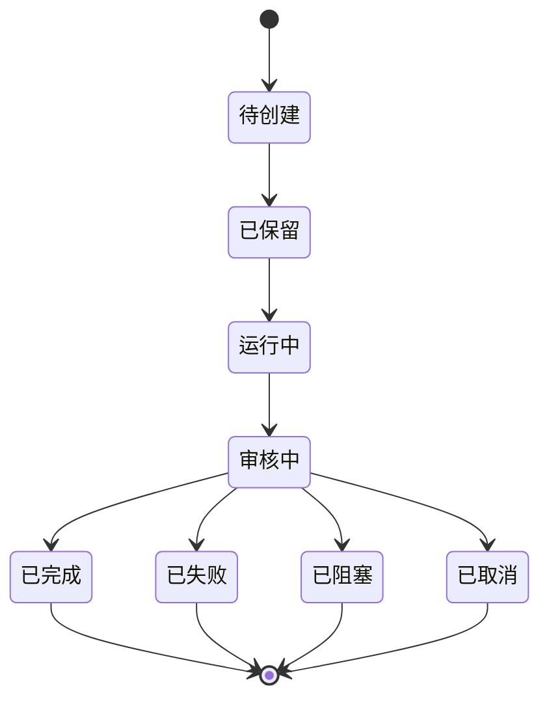

# design-AOE借鉴K8s任务调度算法理论设计-20260527-001

## 一、目标与范围

本文给出一个通用的 AOE 工作流理论模型，用来回答三个基础问题：

1. AOE 在简单任务模式下到底是什么。
2. AOE 如何把内容状态变化、配置变化和人工意图统一收敛为可调度事务。
3. AOE 如何在不把所有事务重新缝成单条串行主链的前提下，形成稳定、可并发、可审计、可恢复的柔性生产线。

本文只讨论控制面与任务化表达，不讨论具体领域事务本身的业务算法。范围边界如下：

1. 只讨论简单任务模式，不展开复杂任务模式、长生命周期父子任务编排或 RL 决策器。
2. 只讨论 AOE 的控制循环、状态差异、事务请求、简单任务、审核与留痕，不改动单个事务程序的业务含义。
3. 只借鉴 K8s 的控制器与调度框架思想，不引入容器编排、节点资源管理、服务发现或集群网络模型。
4. 默认审核部门自动审核，不要求人工参与热路径；人工只作为升级路径保留。

## 二、核心判断

本文采用以下五个总判断作为理论前提：

1. AOE 不是单纯的“定时扫描器”，而是一个 reconciliation loop，也就是控制器循环。
2. 所有事务本质上都是独立事务；主线事务、解析事务、补件事务、回流事务只是在同一控制循环里被统一调度，不应直接互相硬调用。
3. 内容事实、任务调度、审核裁决、运行日志必须分层落库，不能混为一个真相源。
4. 在简单任务模式下，一个事务执行实例对应一个简单任务；事务运行结束后，运行时任务对象退出活跃态，但账本记录必须保留。
5. 没有新的状态 diff，就不创建新的简单任务；AOE 的默认行为不是“看到对象就重跑”，而是“看到有意义的变化才重排”。

这五条判断意味着：AOE 的核心不是把所有事务串成一条长脚本，而是在每个时间步重新对齐“当前事实状态”和“应当推进的目标状态”。

## 三、设计原则

通用 AOE 工作流模型应遵循以下原则：

1. 事务只写事实，不直接触发下游事务。
2. 下游事务由 AOE 根据事实变化、请求变化、配置变化和决策变化统一触发。
3. 主线与解析链解耦；主线只能表达“需要进入预处理/解析阶段”，不能把解析实现硬塞进主线事务内部。
4. 所有调度都必须幂等；同一批对象在同一状态、同一配置版本下不能被重复物化为多个简单任务。
5. 所有调度决定都必须写入任务库，所有审核结论都必须写入决策库，所有控制循环运行都必须写入日志库。
6. 配置变化是一等事件源，不是附属说明；修改事务配置后，AOE 下一拍必须能够识别其影响范围。
7. 简单任务模式下不引入长寿命父子任务树；分支、回流、重试、补件都表现为下一拍新建的简单任务。
8. 审核部门默认自动化运行；只有命中升级规则时才进入人工或 PA 介入路径。
9. 调度必须支持并发，但并发不能破坏同一对象切片上的互斥与幂等。
10. AOE 必须是最终控制器；EA、AA、PA 只能提供解释、建议、执行和人机交互，不能绕过控制循环直接改写主线推进。

## 四、核心对象模型

### 4.1 观测向量

AOE 在每个时间步观察到的不是单一数据库，而是一个分层观测向量：

$$
O_t = (F_t, R_t, C_t, L_t, D_t)
$$

其中：

1. $F_t$ 表示内容事实快照，例如业务对象当前状态、关系事实和阶段摘要。
2. $R_t$ 表示事务请求集合与简单任务集合。
3. $C_t$ 表示配置版本集合，包括全局配置、事务配置、调度策略配置和注册表配置。
4. $L_t$ 表示资源租约、执行者心跳和运行中实例摘要。
5. $D_t$ 表示审核结论、阻断状态和裁决结果。

AOE 不直接比较整个系统的全量哈希，而是按对象切片、事务作用域和批次范围做分片观测。

### 4.2 对象定义

| 对象 | 含义 | 真相源 | 创建规则 | 退出规则 |
| --- | --- | --- | --- | --- |
| 内容事实 | 业务对象的当前真相，例如状态、关系、摘要列 | content.db | 由事务执行提交 | 被后续事务覆盖为新事实，但历史通过日志保留 |
| 状态快照 | AOE 对某一作用域在某一拍看到的摘要 | tasks.db 或缓存层 | 每拍生成 | 下一拍被新快照替代 |
| 状态差异事件 | 两次快照之间的有意义变化 | tasks.db | 旧摘要与新摘要不一致时物化 | 被对应任务消费并归档 |
| 事务请求 | 对某事务的一次正式请求 | tasks.db | 来自内容 diff、配置 diff、人工意图或恢复逻辑 | 被取消、替代、完成或失败后关闭 |
| 简单任务 | 一次事务执行实例 | tasks.db + 任务目录 | 调度器保留租约后创建 | 进入终态后释放活跃运行位 |
| 调度批次 | 一拍内的一组调度决定 | tasks.db | 每个 reconciliation cycle 生成 | 归档后只做审计 |
| 决策记录 | 审核结论、放行、阻断、重试、回退决定 | decision.db | 审核部门或升级路径生成 | 永不删除，只新增 |
| 租约 | 某执行者对某请求或任务的独占执行权 | tasks.db | Reserve 阶段生成 | 到期、提交或显式释放 |
| 心跳 | 运行中执行者的存活声明 | tasks.db 或 logs.db | 运行中任务周期写入 | 任务终止或超时失效 |
| 配置版本 | 配置文件当前版本摘要 | tasks.db 或配置索引 | 每次配置变化生成新摘要 | 历史版本可归档，不应覆盖 |

### 4.3 无 diff 不建任务

对任意作用域切片 $S$，AOE 都应先计算前后两次观测摘要：

$$
H_{t-1}(S),\ H_t(S)
$$

只有在：

$$
H_t(S) \neq H_{t-1}(S)
$$

时，AOE 才允许为该切片物化新的状态差异事件。若两次摘要相同，则该切片本拍不得新建简单任务。

### 4.4 幂等键

每个可调度请求都必须有稳定的幂等键：

$$
K = hash(对象切片, 来源状态, 目标事务, 配置版本, 原因码)
$$

同一 $K$ 在未发生源状态变化之前，不得被重复物化为新的简单任务。即使控制循环重复扫描，也只能看到“已有同幂等键请求/任务存在”的事实，而不能再建第二份。

## 五、分层存储模型

### 5.1 四库边界

AOE 的最小正式分层应如下：

| 层级 | 主要职责 | 必须保存的对象 | 不应保存的对象 |
| --- | --- | --- | --- |
| content.db | 业务事实真相源 | 状态、关系、阶段摘要、当前可消费清单 | 调度批次、运行日志、审核旁白 |
| tasks.db | 调度与任务真相源 | 事务请求、简单任务、调度批次、租约、事件指纹、心跳 | 业务对象最终事实、审核正文 |
| decision.db | 审核与裁决真相源 | 放行、阻断、重试、回退、升级、人工结论 | 原始运行日志、业务事实 |
| logs.db | 运行与审计痕迹真相源 | 控制循环运行、事务执行日志、错误堆栈、观测摘要 | 业务对象主状态、最终调度决策 |

### 5.2 文件系统配套目录

数据库只保存索引字段与关键摘要，复杂上下文应外置到文件系统：

1. `workspace/tasks/requests/<请求UID>/` 保存请求负载、可读摘要、分发结果与归档结论。
2. `workspace/tasks/<任务UID>/` 保存简单任务对应的事务产物、回执、补充索引与运行快照。
3. `workspace/logs/` 保存文本级或结构化控制循环日志、错误上下文与审计导出件。

请求目录与任务目录必须分开，因为“有人请求一件事”和“这件事真的开始跑了”不是同一个对象层级。

### 5.3 建议的最小任务对象集合

通用模型下，tasks.db 至少应支持以下对象：

1. `事务请求`
2. `简单任务`
3. `调度批次`
4. `事件指纹`
5. `资源租约`
6. `执行者心跳`

这是简单任务模式的最小控制面，不要求一开始就上复杂任务树。

## 六、角色分层

### 6.1 角色职责

| 角色 | 默认位置 | 主要职责 | 是否可直接改写主线推进 |
| --- | --- | --- | --- |
| AOE | 引擎控制层 | 观测、归一化、调度、提交、恢复、留痕 | 可以 |
| EA | 引擎级 LLM / 规则解释层 | 解释配置 diff、生成候选动作建议、协助批次编译 | 不可以 |
| AA | 事务级执行层 | 执行单个事务、回传标准回执、写业务事实 | 不可以 |
| PA | IDE/CLI 交互层 | 接用户意图、把自然语言转为正式请求、处理人工升级 | 不可以 |
| 审核部门 | 自动审核层，必要时升级到人工 | 输出放行、阻断、重试、回退结论并写入 decision.db | 不可以绕过 AOE |
| 用户 | 外部输入层 | 输入意图、修改配置、确认升级裁决 | 只通过 PA 或配置入口影响系统 |

### 6.2 自动审核默认开启

简单任务模式下，审核部门默认采用自动审核：

1. 事务完成后立即进入审核阶段。
2. 审核规则优先采用确定性规则，其次可选引擎级 LLM 辅助解释。
3. 审核结果必须写入 decision.db。
4. 只有命中升级条件时，才转给 PA 或人类专家。

### 6.3 AOE 必须是最终裁决执行器

AA、EA、PA 都可以产生建议，但“是否新建任务、是否继续、是否回退、是否终止”必须由 AOE 根据规则与决策库结论统一执行。这样系统才可回放、可审计、可恢复。

## 七、AOE 控制循环

### 7.1 时间步

AOE 以固定时间步运行，默认每 60 秒扫描一次，但该值只是调度节拍，不是业务语义。它还应支持人工触发、API 触发和恢复触发；这些触发都必须复用同一 reconciliation loop，而不是绕开控制循环另开旁路。

### 7.2 控制循环九阶段

#### 阶段 1：观测快照

AOE 在当前时间步读取：

1. content.db 的业务事实与关键视图。
2. tasks.db 中待执行请求、活跃任务、租约与心跳。
3. decision.db 中未消费或刚变化的裁决。
4. logs.db 中上一拍的运行摘要。
5. 配置目录中的全局配置、事务配置、调度配置与注册表版本。

输出物是本拍的观测快照集合，而不是马上建任务。

#### 阶段 2：状态差异提取

AOE 以切片方式比较前后两拍摘要，生成候选 diff。切片维度至少包括：

1. 对象切片，例如一批文献、一组数据对象、一类资源队列。
2. 事务作用域，例如检索、补件、预处理、阅读、审计。
3. 配置作用域，例如某个事务配置、某个调度策略、某个全局运行参数。

此阶段只回答“哪里变了”，不回答“该做什么”。

#### 阶段 3：事件归一化

AOE 将原始 diff 归一化为统一事件类型，常见事件包括：

1. 内容事实变化事件。
2. 配置变化事件。
3. 决策变化事件。
4. 手工注入事件。
5. 租约超时恢复事件。

配置变化事件不是直接执行事务，而是先交给 EA 做“配置影响编译”：

1. AOE 发现某个配置版本变了。
2. EA 解释该变化影响哪些事务、哪些对象切片、是否需要重算或重启。
3. AOE 再把 EA 产出的影响摘要归一化为正式事务请求。

#### 阶段 4：幂等去重

AOE 对每个事件计算幂等键，并查询：

1. 是否已有相同幂等键的未关闭请求。
2. 是否已有相同幂等键的运行中任务。
3. 是否已有相同幂等键的最新成功处理结果，且源状态尚未变化。

只要任一条件成立，本拍都不得再次物化该任务。

#### 阶段 5：事务请求物化

通过去重后，AOE 将候选事件转成正式事务请求。事务请求必须明确：

1. 目标事务。
2. 来源对象与来源状态。
3. 请求原因码。
4. 关联配置版本。
5. 请求负载路径。
6. 默认优先级与并发策略。

这一步把“系统看到变化”转换为“系统决定发出正式请求”。

#### 阶段 6：Filter/Score/Reserve

AOE 调度器只调度“正式事务请求”，不直接调度裸内容对象。调度流程遵循 K8s 式三段：

1. Filter：过滤不可执行、被阻断、缺配置、租约占用、未满足前置条件的请求。
2. Score：对可执行请求做多因子评分。
3. Reserve：为选中的请求领取租约，形成待执行简单任务。

#### 阶段 7：简单任务执行

被保留租约的请求会生成一个简单任务。简单任务只干一件事：

1. 绑定一个事务。
2. 绑定一个请求。
3. 绑定一个对象批次范围。
4. 调用对应 AA 或事务程序执行。

事务执行阶段必须回传标准回执，包括：

1. 实际处理对象范围。
2. 结果状态。
3. 产物位置。
4. 失败原因。
5. 建议的后续动作。

#### 阶段 8：自动审核与裁决

事务结束后立即进入审核阶段：

1. 审核部门读取事务回执与业务事实变化。
2. 输出放行、阻断、重试、回退、人工升级等结论。
3. 决策记录写入 decision.db。
4. AOE 消费该决策，决定是否关闭请求、是否重建请求、是否生成恢复任务。

#### 阶段 9：四库提交与归档

AOE 必须在收尾时同步提交：

1. 业务事实进入 content.db。
2. 请求、简单任务、调度批次、租约结果进入 tasks.db。
3. 审核结论进入 decision.db。
4. 控制循环与事务日志进入 logs.db。

至此，本拍结束，系统回到下一次观测。

## 八、调度模型

### 8.1 多因子评分

在通用模型里，AOE 调度器的评分函数建议为：

$$
Score = w_p P + w_a A - w_r R - w_s S + b_e E
$$

其中：

1. $P$ 表示业务优先级。
2. $A$ 表示等待年龄，用于防饥饿。
3. $R$ 表示重试惩罚，避免失败请求无限霸榜。
4. $S$ 表示来源压力惩罚，避免单一来源挤占全部执行位。
5. $E$ 表示执行者粘性或缓存友好度加分。

这套评分只影响“先跑谁”，不影响业务事实，也不改变任务状态机。

### 8.2 过滤规则

一个请求至少在以下情况下会被 Filter 拦下：

1. 目标事务未注册或配置缺失。
2. 前置条件未满足。
3. 相同对象切片已有有效租约。
4. 决策库明确阻断。
5. 配置版本与请求绑定版本不兼容。
6. 执行者并发上限已满。

### 8.3 并发与切片互斥

AOE 可以并发执行多个简单任务，但必须满足：

1. 同一对象切片不可被两个同类事务同时修改。
2. 同一请求不可被两个执行者同时领取。
3. 同一事务族可设置并发上限。
4. 同一配置版本切换过程中，应保证旧任务收尾后再让新配置接管新请求，除非显式配置允许中断。

## 九、简单任务模式

### 9.1 定义

简单任务模式的正式定义是：

1. 一个简单任务只对应一次事务执行实例。
2. 任务创建发生在事务执行前。
3. 任务运行结束后，其活跃运行位被释放。
4. 任务历史记录、请求记录、审核记录和日志记录保留，不做物理删除。

也就是说，“销毁任务”在这里指的是运行时对象退出活跃态，而不是账本记录消失。

### 9.2 状态机

### 9.3 分支、回流与结束

简单任务模式下：

1. 分支不通过长生命周期父子任务表达，而通过下一拍生成多个新请求来表达。
2. 回流不通过在当前任务内部回跳表达，而通过上一阶段事务的新请求来表达。
3. 结束不是“主流程脚本跑到最后一行”，而是当前对象切片在当前策略下不再产生可执行 diff。

因此，系统的动态性来自“每拍重规划”，而不是来自任务本体无限生长。

## 十、事件源目录

| 事件源 | 检测条件 | 默认解释者 | 典型后续动作 |
| --- | --- | --- | --- |
| 内容事实变化 | 关键状态摘要发生变化 | AOE 规则层 | 生成面向下游事务的正式请求 |
| 配置变化 | 配置哈希、mtime 或版本号变化 | EA 编译层 | 生成配置重编译请求或影响面请求 |
| 手工意图 | 用户通过 PA/CLI/API 输入指令 | PA 到请求网关 | 创建手工请求并交 AOE 调度 |
| 决策变化 | 审核结果从待定变为通过/阻断/重试 | AOE 控制层 | 放行、阻断、恢复、回退 |
| 租约异常 | 心跳超时、执行者失联、租约到期 | AOE 恢复层 | 释放租约并重建待调度请求 |

这张表说明：任何变化都先转成统一事件，再通过请求进入调度，而不是直接让某个外部角色越权调用事务。

## 十一、配置模型

AOE 至少需要一组简单任务模式配置：

1. `scan_interval_seconds`：扫描周期。
2. `diff_scope_policy`：状态 diff 的切片规则。
3. `dedupe_ttl_seconds`：幂等缓存有效期。
4. `scheduling_policy`：Filter/Score/Reserve 的权重与候选池策略。
5. `auto_review_policy`：自动审核规则与升级条件。
6. `concurrency_policy`：每类事务的并发度与批次大小。
7. `config_change_policy`：配置变化对运行中任务和新请求的影响规则。
8. `recovery_policy`：心跳超时、失败重试、回退与阻断传播策略。

配置变化本身也必须被版本化，因为事务请求总是与某个配置版本绑定。只有这样，系统才具备可回放性。

## 十二、失败、恢复与回滚

### 12.1 失败类型

AOE 至少要区分：

1. 事务业务失败。
2. 配置不合法导致的执行失败。
3. 执行者异常退出导致的租约悬挂。
4. 审核不通过导致的业务阻断。
5. 配置切换导致的运行时不一致。

### 12.2 恢复策略

默认恢复路径如下：

1. 若任务失败但允许重试，则写决策记录并生成带新幂等键后缀的恢复请求。
2. 若执行者失联，则回收租约并把原请求重新置回待调度。
3. 若审核阻断，则请求终止，等待人工或规则变化。
4. 若配置变化要求重跑，则旧请求归档，新版本请求重新物化。

### 12.3 回滚语义

简单任务模式的回滚不是“数据库回到上一秒”，而是：

1. 把错误决策、错误请求、错误任务标记为失败/取消/已替代。
2. 由新请求按当前正确配置重新计算。
3. 历史记录保留，以支持审计和复盘。

## 十三、K8s 借鉴边界

AOE 借鉴 K8s 的真正对象不是容器，而是三个抽象：

1. Controller loop：不断对齐当前状态与期望状态。
2. Scheduler pipeline：Filter -> Score -> Reserve。
3. Declarative reconciliation：通过事实差异反复收敛，而不是一次性脚本跑完。

AOE 不应照搬以下内容：

1. 集群节点资源模型。
2. Pod/Deployment/Service 的资源对象语义。
3. 网络服务发现与 sidecar 模式。
4. 复杂抢占、跨节点拓扑和底层容器运行时抽象。

## 十四、验收标准

通用 AOE 工作流模型若要认为设计成立，至少应满足：

1. 对同一对象切片，在无状态 diff 的情况下不会重复创建简单任务。
2. 任一事务完成后，content.db、tasks.db、decision.db、logs.db 的职责边界清晰且可追溯。
3. 手工请求、配置请求、内容请求都能统一进入同一调度路径。
4. 简单任务终态后，活跃运行位释放，但账本记录完整保留。
5. 调度顺序不再只由单一优先级决定，而是可以通过多因子策略调整。
6. 任何放行、阻断、重试、回退都能在 decision.db 中找到正式记录。
7. 任一失败任务都可以根据日志和请求负载回放问题定位。
8. 主线事务与解析事务不会重新耦合成单个超大事务。

## 十五、结论

AOE 的正确定位不是“每分钟扫一次数据库然后顺手跑几个事务”，而是“每个时间步重新对齐事实、请求、配置、租约和决策的控制器循环”。

在简单任务模式下，这个模型已经足以支持：

1. 事务独立执行。
2. 主线与解析链解耦。
3. 基于 diff 的新任务生成。
4. 自动审核默认运行。
5. 用四库分层实现可并发、可恢复、可审计的柔性生产线。

因此，AOE 借鉴 K8s 的最优路线不是去做一个小型容器平台，而是把 reconciliation loop、Filter/Score/Reserve 和幂等控制真正做成自己的通用控制面。